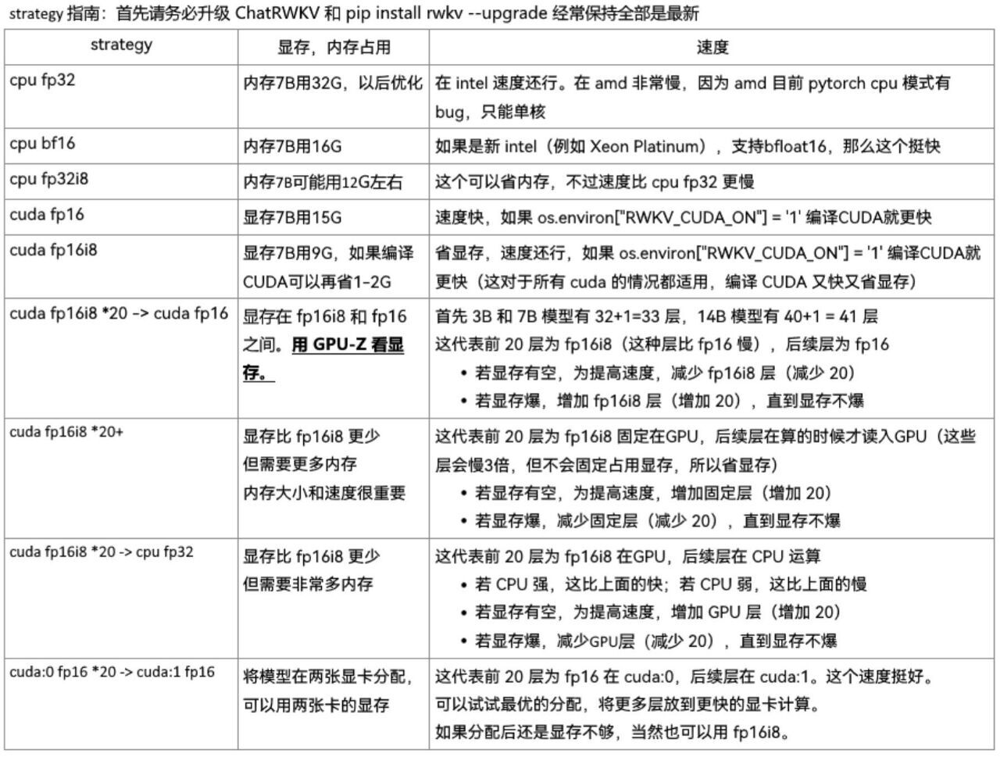
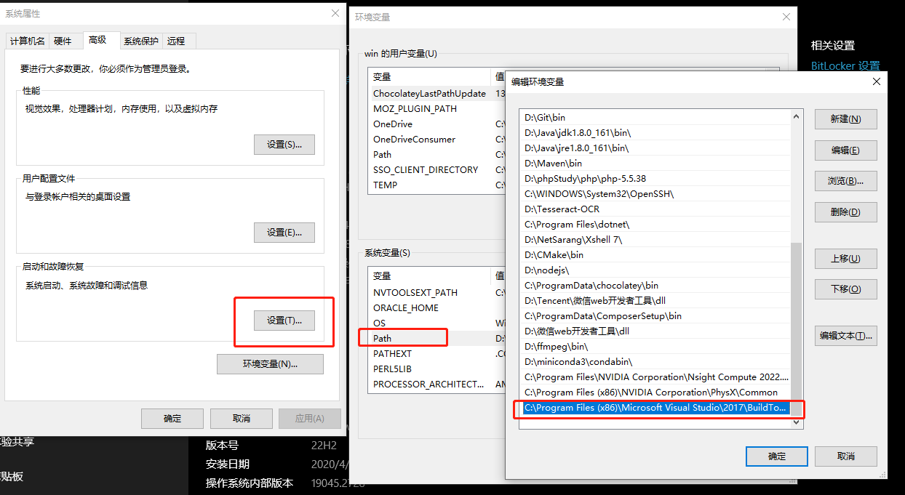

没有显卡？显存不足？内存不足？环境不会配置？现在都不用怕了，直接白嫖Google Colab吧！

## [点击这里快速到达](https://colab.research.google.com/drive/19cKRLE6WBVoVK1cHPNuc3KvmeQ9TO19G#scrollTo=t4daxu3L1Rbi)

如果需要给角色加头像的话，可以把头像命名为"角色名.png"放在char目录下，至于头像去哪儿找嘛……用sd生成一个就好了。

该项目虽然是个webui，但是不适合多人同时使用，如果需要多用户的话，可以参考这个项目

https://github.com/shengxia/RWKV_Role_Playing_API

## 一个基于RWKV的角色扮演玩具


就是这么一个玩意儿，连抄带编的弄出来了一个玩具，所以代码质量吗……请各位不要吐槽太多，但是也算是能玩吧。

另外，如果不知道人物性格怎么设定的话，我建议你可以下载一个Glow，这是[官网地址](https://glowapp.vip/)，然后到上面去找智能体，直接把它们的性格粘过来用是完全没问题的。

这段时间我到[Chub](https://www.chub.ai)上面翻了翻角色卡，找了一些高质量的角色卡测试了一下，虽然上面的内容英文的比较多，但是稍微整理一下格式，放进去用还是没啥问题的，虽然我知道模型有语言迁移的能力，但是亲自尝试一下还是觉得挺神奇的，就是我可以用中文来回复，然后模型说话的时候用英文，而且上下文还搭能得上，我也不知道是因为RWKV英文能力更强还是这角色卡写得好，回复的还挺带感的，至少比我自己写的中文角色卡好上不少，感兴趣的话，大家也可以试试这种玩儿法，反正对我来说，看英文比写英文要简单多了。

目前我不再支持Raven系列的模型，而是改用World系列的模型了，这个模型在角色扮演上好太多了，另外我在FAQ中也推荐了一些其他的模型，他们同样也非常适合角色扮演，如果你使用的是老版本的话，可能还需要更新一下RWKV库

```
pip install rwkv --upgrade
```

如果更新拉取代码后，运行起来发现会报错，请更新一下gradio

```
pip install gradio --upgrade
```

最近的更新中我又把角色的初始状态保存在了`save/init_state/`下面，在切换模型后，除了要删除save文件夹下的.sav文件，记得也把这里的.sav文件删除一下，不然会报错。

### 安装方法：

先安装依赖
```
pip install torch==1.13.1 --extra-index-url https://download.pytorch.org/whl/cu117 --upgrade

pip install -r requirements.txt
```

启动：
```
python webui.py --listen --model model/path
```

以下是一个例子: 
```
python webui.py --listen --model model/RWKV-x060-World-3B-v2-20240228-ctx4096
```
各种启动参数解释如下：

| 参数 | 解释 |
| --- | --- |
| --port | webui的端口 |
| --model | 要加载的模型路径 |
| --strategy | 模型加载的策略 |
| --listen | 加上这个参数就允许其他机器访问 |
| --cuda_on | 控制RWKV_CUDA_ON这个环境变量的，0-禁用，1-启用 |
| --jit_on | 控制RWKV_JIT_ON这个环境变量的，0-禁用，1-启用 |
| --share | 生成gradio链接 |
| --lang | 语言，zh-中文，en-英文 |
| --autosave | 是否自动保存对话进度，目前默认是不自动保存了，因为RWKV5之后的state变大了好多，如果需要的话记得把这个参数加上 |

模型的加载方式（--strategy）我默认使用的是"cuda fp16i8"，如果想使用其他的加载方式可以自行调整该参数，具体有哪些值可以参考[这个文章](https://zhuanlan.zhihu.com/p/609154637)或者这张图

## FAQ

### 1. 能让AI生成文字的速度再快一点吗？

当然可以，在启动命令中加入--cuda_on 1，例子：
```
python webui.py --listen --model model/RWKV-x060-World-3B-v2-20240228-ctx4096 --cuda_on 1
```
但是你的机器必须安装Visual C++生成工具，以及Nvidia的CUDA以及CUDNN，CUDA和CUDNN比较好解决，去官网下载就行了，建议安装11.7版本，这个Visual C++生成工具可以参考[这个链接](https://learn.microsoft.com/zh-cn/training/modules/rust-set-up-environment/3-install-build-tools)装好之后还需要配置一下环境变量，如下图：

我这里配置的值是C:\Program Files (x86)\Microsoft Visual Studio\2017\BuildTools\VC\Tools\MSVC\14.16.27023\bin\Hostx64\x64，你们根据实际情况进行配置，主要是找到cl.exe这个文件所在的文件夹，当然也要注意架构，不过一般来说，大家都是64位的系统了吧。这样就算是完成了，然后再运行脚本，你会发现文字的生成速度提高了很多。

### 2. 我在哪里可以下载的到模型呢？

当然是在[这里](https://huggingface.co/BlinkDL)或者[使用镜像](https://hf-mirror.com/BlinkDL)，这里推荐rwkv5和rwkv6的模型（其实我更推荐rwkv6，别看这玩意儿现在最大只有3B，但是效果是真的不错）。

另外也推荐Xiaol发布的模型，地址在[这里](https://huggingface.co/xiaol)，[镜像地址](https://hf-mirror.com/xiaol)，这里有12B的模型，很适合有大显存（24G）的玩家尝试。

还有一些比较好的模型，比如EleutherAI的[Hermes-RWKV-v5-7B](https://huggingface.co/EleutherAI/Hermes-RWKV-v5-7B)，[镜像地址](https://hf-mirror.com/EleutherAI/Hermes-RWKV-v5-7B)，但是这个模型我这套程序没办法支持，因为需要改对话格式，如果你有编程能力的话可以自己在我代码的基础上进行更改，主要就是拼字符串，反正也不难。

不太推荐a686d380的rwkv-5-h-world系列模型，倒不是这个模型不好（它使用的数据集算是一座宝库），主要是他的那个模型是主打小说续写，不适合角色扮演。

### 3. top_p、top_k, temperature、重复惩罚这几个参数有什么设置技巧吗？

- top_p值越低，答案越准确而真实。更高的值鼓励更多样化的输出。
- top_k值越低，答案越准确而真实。更高的值鼓励更多样化的输出。top_k会先于top_p生效，即先根据top_k值确定所选token范围后再根据top_p值确定所选token范围。
- temperature值越低，结果就越确定，因为总是选择概率最高的下一个词/token，为 0 将始终产生几乎完全相同的输出。拉高该值，其他可能的token的概率就会变大，随机性就越大，输出越多样化、越具创造性。
- 重复惩罚值不建议太高，一般在0.1到0.3之间就行了，太高容易出问题（我看论文中说0.2就不错）。
- 上下文惩罚，这个参数是用来惩罚聊天记录中出现次数过多的内容（比如聊着聊着就发现无论和剧情有没有关系，都会输出“xx听到了你的话，”这种内容），本来我是在代码中写死值为3，但是后来发现，中文和英文需要的惩罚值可能不一样，于是就把这个作为参数让玩家自己调整了，这个词如果调的太大，可能会出现降智或者说话不利索的情况（毕竟太大了相当于把这个词给ban掉了，导致无词可用），所以请酌情调整，如果想禁用该功能，请将值设置为0。

RWKV目前的迭代速度非常快，而且每次更新提升都很大，所以模型尽量用新的。

这里建议使用如下配置：
```
{
  "top_p": 0.6,
  "top_k": 0,
  "temperature": 2,
  "presence": 0.2,
  "context": 3,
}
```
如果感觉输出的内容比较长，可以降低top_p和temperature。

### 4. 模型会在输出回答后，又输出一大堆乱七八糟的内容。

我增加了一个调试页面，可以查看当前的token内容，一般输出乱七八糟的内容都是对话格式有误，正确的对话格式是这样的：
```
用户名: xxxxxxxxx

角色名: xxxxxxxx

用户名: xxxxxxxxxxxxxxx

```
其中冒号是英文冒号且冒号后面有一个空格，每句对话后面都有两个换行（\n\n）。如果可以，尽量不要在角色名中加空格。

### 5. 为什么模型的输出内容总是和上一次的输出内容部分重复甚至完全重复？

关于这一点我并不知道具体的原因，但是这一现象确实存在，我也在想办法避免，但是我的能力实在是有限，虽然做了一些尝试，但是效果并不好。
目前我的感觉是，大概进行5到6轮对话后，开始出现回复内容部分重复现象，于是我尝试着在重新生成的时候对top_p和temperature参数增加一个小的随机的扰动，让生成的回复尽量不要显得太有规律（经过测试，不能说是效果显著，只能说是聊胜于无）。所以实在不行，就通过“替角色说”这一个功能，把回复的内容给拷贝下来，然后把重复的地方给删了，这样或许效果会好一些。

最近我又做了一些尝试，大概思路是，比较一下上两次生成的内容，如果里面有重复的地方，我就对这些地方进行额外的惩罚，重新生成的时候，我会把重新生成的内容与最近5次生成进行比较，找出重复的地方，然后对这些地方进行额外的惩罚，这样大概能够保证重复的没那么厉害，至少重试几次之后，是不会生成完全重复或部分重复的情况了。

### 6. 为什么你的colab里要用fp16i8的7B模型？

没办法啊，免费的colab就给12G的内存，我用原版的7B模型，加载需要内存14G，colab它加载不进去啊！

### 7. 为什么不用流式输出？

在dev分支的某个版本中我尝试着使用了流式输出，虽然效果还不错，但是在对话久了之后，速度明显慢了，主要是传回的html代码大了，一句话十个字就得传10次，拖慢了速度，也有点耗费流量，感觉得不偿失（你说在本地用不怕耗流量？但是我喜欢用手机随时随地玩）当然，也可能是我的水平没到，写不出来增量传输。

### 8. 为什么清除上一条对话然后再生成对话时，需要这么长的时间？

因为我不会用gradio清除多条对话，所以只能让用户一条一条的清除，但是以前的方法，每清除一条就要重新计算一次状态的确有点儿浪费，于是我改了一下逻辑，你可以随意清除上一条，我这边只记录下来你清除了多少，当你再次对话的时候，我就一次性的把状态回退到你清除的那个地方，这样在清除多条的时候就比较省时（当然了，这个重新计算状态所耗的时间实在是没办法，除非你勤存档）。

### 9. 界面有英文了，为啥README没有英文？

别太难为我了，你要看了我那个英文的语言文件就知道我英文水平啥样了，出个英文的README有点儿太难为我了。

### 10. 还有其他想说的吗？

我在角色选项卡中增加了一个选项，可以使用User和Assistant来代替你和角色的名称，使用该选项生成的格式如下：
```
User: xxxxxxxxx

Assistant: xxxxxxxx

User: xxxxxxxxxxxxxxx

```
不使用该选项生成的格式如下：
```
User: 用户名: xxxxxxxxx

Assistant: 角色名: xxxxxxxx

User: 用户名: xxxxxxxxxxxxxxx

```
随着模型的更新，目前就算使用User和Assistant的感觉已经好了很多，而且对话生成的效果比使用“用户名和角色名”要好（目前7B的模型还是规模较小，生成过长的文字很容易跑偏，所以我把控制输出长度的功能都给删了），但是也会有一些思想钢印的存在（比如AI会很拒绝做坏事，就算做了也是不情不愿的，但是使用“用户名和角色名”时就不会这样）。总之可以根据各位的喜好来修改。

**不过需要注意的是，在修改完角色选项卡中的任何项目并点击保存后，程序会清空当前的对话（不清空没办法让修改后的设置生效），所以进行此操作务必谨慎。**
